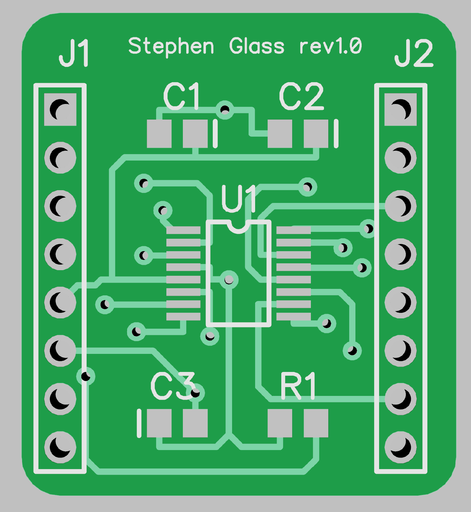

# PCB Design
## Stephen Glass

The contents in this folder are for a simple MSP430FR2311 PCB breakout board. The circuit uses surface mount components and utilizes proper reset circuitry to have the processor running correctly.

## Contents
### GERBER Files

Gerber files can be found in the GERBER folder. As per the ECE Resource Center guidelines the following files must be included to have a board sent for manufacturing:
* HelloWorld1.drl
* HelloWorld1.gbl
* HelloWorld1.gbo
* HelloWorld1.gbs
* HelloWorld1.gko
* HelloWorld1.gtl
* HelloWorld1.gto
* HelloWorld1.gts

### DipTrace Design Files

The DipTrace design files for the schematic and PCB for the breakout board can be found in the root directory of the PCB Design folder:
* HelloWorld.dch (Schematic)
* HelloWorld1.dip (PCB Design)

### Images

Since we are getting closer to building realistic systems in your final projects, you will most likely need to build a PCB so that you are not worrying about carrying around a rat's nest of wires. Really, the basics of PCB design are quite simple: make a schematic to lay out what components need to be connected to each other, then import the schematic to a PCB designer and physically connect the components together. Where the difficulty comes in is in the tedium. For low-frequency, low power applications, you should be able to get away with pretty much anything you do. 

As the semester progresses we will be dealing with more applications which will require you to build boards with higher signal integrity and power carrying capabilities, but we will cross that bridge when we get to it.

## Task
You will be required to design a simple breakout board for the MSP430FR2311. This is one of the simplest processors you have to design for, requiring you to only place a few capacitors to get it to work. You might think wait, but isn't there all that stuff up at the top of the board? Don't we need to also include that? All of those parts are part of the programmer/debugger and it is very easy to program your chip using just a few wires.

## Deliverables 
This folder should contain the following files:
* BOARD.sch
* BOARD.pcb
* GERBERS (Folder)

The GERBERS folder should contain the Gerber files as listed in the ECE Department ordering guides for PCBs.

The README for this folder should also contain the Bill of Materials as well as (if possible) a link to a Digikey/Mouser cart that contains the parts you would want for this board.

## Board Details
Your board should be a 2 layer board which can conveniently fit on a breadboard and contains the required passives for this processor to work in a standalone implementation. This means that the board should contain bypass capacitors, and the proper reset circuitry as laid out in the MSP430FR2311 datasheet. As per PCBWAY manufacturing restrictions, you should not have any traces smaller than 6mil, and your board should be smaller than 4 inches per side (which is maybe 4 times larger than your board should be.)

It will be up to you to determine the capacitor brands, values, and sizes, as well as which package you want for your MSP430FR2311.