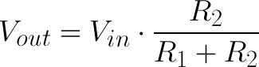

# Sensors and Signal Conditioning
## Stephen Glass

This lab will focus on utilizing and reading the ADC and conditioning a sensor to provide a decent output. We will build the proper circuitry to take measurements from sensors which convert a physical phenomena into:
* Voltage
* Current
* Resistance

The files in this project are compatible with both ADC10 on the MSP430FR5994 and ADC12 on the MSP430FR5994 and MSP430FR6989.

## Pressure Sensor
A pressure sensor is used to read the amount of pressure that is being exerted on to the sensor. The sensor is calibrated and conditioned so when the sensor is tightly squeezed an LED will turn on the LaunchPad development board.

### Compatibility
* MSP430FR2311 (PressureSensor/MSP430FR2311/msp430fr2311_pressure.c)
* MSP430FR5994 (PressureSensor/MSP430FR5994/msp430fr5994_pressure.c)
* MSP430FR6989 (PressureSensor/MSP430FR6989/msp430fr6989_pressure.c)

## Photodiode
A photodiode (current controled device) will be used in photovolatic mode to read the amount of light measured into the ADC. An LED on the LaunchPad development will turn on when the amount of light reaches a bright level (Flashlight used for testing).

### Compatibility
* MSP430FR2311 (Photodiode/MSP430FR2311/msp430fr2311_photodiode.c)
* MSP430FR5994 (Photodiode/MSP430FR5994/msp430fr5994_photodiode.c)

## Photoresistor
A photoresistor will be used to take in the amount of resistance due to the light being captured. This sensor works inversely for this application as in, when the resistor is subject to a dark room, an LED on the LaunchPad development board will turn on. This application is similar to a nightlight. A sample schematic for this circuit can be seen in the section below.

### Compatibility
* MSP430FR2311 (Photoresistor/MSP430FR2311/msp430fr2311_ldr.c)
* MSP430FR5994 (Photoresistor/MSP430FR5994/msp430fr5994_ldr.c)

## Hardware
ADC reads in voltage, therefore, we need to convert any resistance or current to a voltage output. To do this we can use create a voltage divider for each of our sensors.

The R2 resistor and the power supply will remain constant. Therefore, the voltage output into the ADC input of the microprocessor will depend on the resistance of the sensor.

## Software
For all boards, the board will communicate with UART on 9600 board transmitting the latest ADC reading. The MSP430FR2311 uses ADC10 while the MSP430FR2311 and MSP430FR5994 use ADC12. ADC10 has 2^(10) bits of resolution while ADC12 has 2^(12) bits of resolution. The initialization of ADC for each of these boards will be slightly different. The code for ADC initialization can be seen in the initADC() functions.

## Sample Schematic
The photodiode, photoresistor, and pressure sensor are all configured in the same fashion. A sample breadboard schematic of how the Photoresistor was configured can be seen below.

