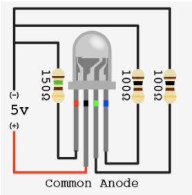

# Visualizing Data
## Stephen Glass

This lab will focus on visualizing the ADC input using two different methods: LCD Display and RGB LED. Using a pressure sensor, we will show how the ADC can be converted to a integer number on the LCD Display and how the RGB LED can be used to show different colors for different pressure senseitivity.

The LCD Display and RGB LED are used simulatanously on the same board at the same time.

## Compatibility
* MSP430FR6989 (MSP430FR6989/msp430fr6989_led_pressure.c) *LCD Driver Required*

## RGB LED
The output of the pressure sensor can be visualized using a RGB LED.
### Hardware
PWM outputs from the microprocessor are connected to each Red, Green, Blue connector for the LED. The circuit diagram for the RGB LED can be seen below.


### Software
1. When the reading of the pressure sensor equates to a low pressure output, the RGB LED will glow Green.
2. When the reading of the pressure sensor equates to a medium pressure output, the RGB LED will glow Yellow/Orange.
3. When the reading of the pressure sensor equates to a high pressure output, the RGB LED will glow Red.

The Software uses Hardware PWM on three output pins which are connected to the RGB LED.

## LCD Display
The output of the pressure sensor can be visualized using a LCD Display.
### Hardware
While using the MSP430FR6989, the LCD Display is built into the LaunchPad development board. Therefore, there is no additional hardware configuration besides the sensor configuration itself. In order to use the LCD Display we will be using the LCDDriver library package (included).

### Software
The software takes in the output of the sensor and converts it to a format that is able to be output on the LCDDisplay. The microprocessor takes the output and splits the integer into corresponding digits that can be shown on the LCD Display.
```
ADC_check = ADC_Result;
ADCdisplay = 4;
while (ADC_check > 0)
{
    int digit = ADC_check % 10;
    if(digit == 0) showChar('0', ADCdisplay);
    else if(digit == 1) showChar('1', ADCdisplay);
    else if(digit == 2) showChar('2', ADCdisplay);
    else if(digit == 3) showChar('3', ADCdisplay);
    else if(digit == 4) showChar('4', ADCdisplay);
    else if(digit == 5) showChar('5', ADCdisplay);
    else if(digit == 6) showChar('6', ADCdisplay);
    else if(digit == 7) showChar('7', ADCdisplay);
    else if(digit == 8) showChar('8', ADCdisplay);
    else if(digit == 9) showChar('9', ADCdisplay);
    ADCdisplay--;
    ADC_check /= 10;
}
```